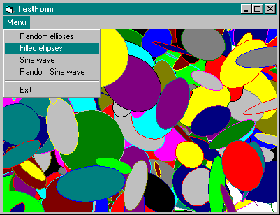



## Rotating ellipses and sine waves using Bezier

### Description

With several points you can draw curves with high resolution at any magnification.

Bezier curves can be easily filled, exported to WMF and their plotting is even HW accelerated.
 
### More Info
 
There is no way to plot part of curves.

             |
---                |---
**Submitted On**   |2002-10-22 17:42:38
**By**             |[Jan Tosovsky](https://github.com/Planet-Source-Code/PSCIndex/blob/master/ByAuthor/jan-tosovsky.md)
**Level**          |Beginner
**User Rating**    |5.0 (40 globes from 8 users)
**Compatibility**  |VB 5\.0, VB 6\.0
**Category**       |[Graphics](https://github.com/Planet-Source-Code/PSCIndex/blob/master/ByCategory/graphics__1-46.md)
**World**          |[Visual Basic](https://github.com/Planet-Source-Code/PSCIndex/blob/master/ByWorld/visual-basic.md)
**Archive File**   |[Rotating\_e14872210262002\.zip](https://github.com/Planet-Source-Code/jan-tosovsky-rotating-ellipses-and-sine-waves-using-bezier__1-40161/archive/master.zip)

